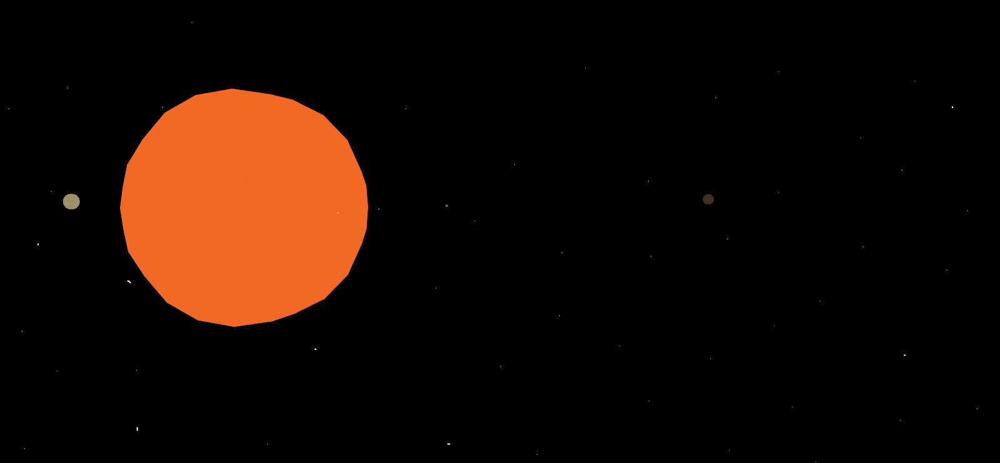
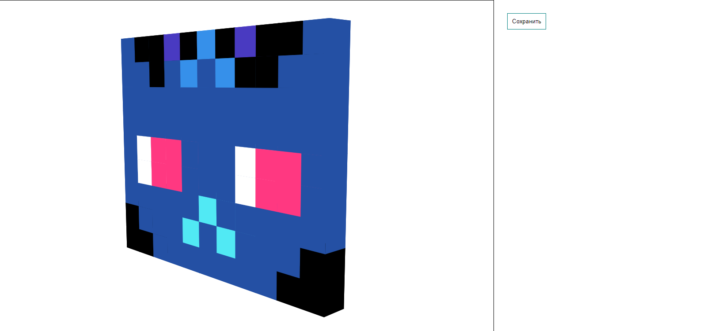

# 3D SVG engine
Lightweight 3d engine that uses SVG as a rendering environment.

Used technologies:
* Webpack for build project
* Typescript as main language engine

# Getting started

You can link to a 3d SVG engine files hosted online. You can use these links:
```html
<script src="https://cdn.jsdelivr.net/npm/3d-svg-engine@0.1.0/dist/3dengine.dist.js"></script>
```
A sample HTML page might look like this:
```html
<!DOCTYPE html>
<html lang="en">
<head>
    <meta charset="UTF-8">
    <title>Starter template</title>
</head>
<body>
  <div id="world"></div>
  <script src="https://cdn.jsdelivr.net/npm/3d-svg-engine@0.1.0/dist/3dengine.dist.js"></script>
  <script>
    // create global object
    const engine = SVGEngine('world')
    // add cube on scene
    engine.add(engine.cube(10))
  </script>
</body>
</html>
```
## How to control camera

For pointer lock you should click on root tag. 

You can rotate camera with mouse movement. And  next keys to control camera:
### keys
| Key    | Effect       | 
|---------:|:-------------| 
| *WASD* |  Move camera | 
| *shift* |    Flying down |
| *spacebar* |   Flying up |
| *arrows* |    Rotate camera |

# Examples
Here some examples usage this library

* Simple model solar system: [Example](http://man_init.istu.webappz.ru/3d/dist/) 
* Voxel draw: [Example](http://man_init.istu.webappz.ru/3d/example2/) 
# Documentation

## Basic figures
### cube(size, x, y, z, color)
Create  object of cube
#### Parameters: 

| Param    | Description       | Default | Example |
|---------:|:-------------| :------: | :-----: |
| *size* |  Cube side length | -  | ```10.23``` |
| *x* |    x coordinate of the center of the cube    | ```0```  | ```12``` | 
| *y* |    y coordinate of the center of the cube    | ```0```  | ```23``` |
| *z* |    z coordinate of the center of the cube   | ```0```  | ```34``` |
| *color* | Cube color | ```'black'``` | ```'#ff4433ee'``` |

### pyramid(size, x, y, z, color)
Create  object of pyramid
#### Parameters: 

| Param    | Description       | Default | Example
|---------:|:-------------| :------: | :------: |
| *size* |  Pyramid side length | -  | ```23.4``` |
| *x* |    x coordinate of the center of the pyramid    | ``0``  | ```23.3``` |
| *y* |    y coordinate of the center of the pyramid    | ``0``  | ```534.2```|
| *z* |    z coordinate of the center of the pyramid   | ``0``  | ```-23.3```|
| *color* | Pyramid color | ```'black'``` |  ```'#ffee99ee'``` |

### parallelepiped(sizea, sizeb, sizec, x, y, z, color)
Create  object of parallelepiped
#### Parameters: 

| Param    | Description       | Default |  Example
|---------:|:-------------| :------: | :------: |
| *sizea* |  Parallelepiped length to depth   | -  | ```23.4``` |
| *sizeb* |  Parallelepiped height | -  | ```-12.3``` |
| *sizec* |  Parallelepiped width | -  | ```-10.3``` |
| *x* |    x coordinate of the center of the parallelepiped    | ```0```  | ```23``` |
| *y* |    y coordinate of the center of the parallelepiped    | ```0```  | ```2.2``` |
| *z* |    z coordinate of the center of the parallelepiped    | ```0```  | ```-3.2``` |
| *color* | Pyramid color | ```'black'``` | ```'#ff443366'``` |

### sphere(r, x, y, z, color)
Create  object of sphere
#### Parameters: 

| Param    | Description       | Default | Example |
|---------:|:-------------| :------: | :------: |
| *r* |  Sphere radius  | -  | ```34.4``` |
| *x* |    x coordinate of the center of the parallelepiped    | ```0```  | ```23``` |
| *y* |    y coordinate of the center of the parallelepiped    | ```0```  | ```23.4``` |
| *z* |    z coordinate of the center of the parallelepiped    | ```0```  | ```34.5``` |
| *color* | Pyramid color | ```'black'``` | ```'#99339900'``` |

## Basic figures methods
All figures have methods for moving and rotating
### <figure>.translate(x, y, z)
Мove the figure. Arguments define how much the figure moves in each direction.
#### Parameters: 

| Param    | Description       | Default | Example |
|---------:|:-------------| :------: | :------: |
| *x* |    Moves along x axis     | - | ```23``` |
| *y* |    Moves along y axis    | - | ```23.4``` |
| *z* |    Moves along z axis    | - | ```34.5``` |

### <figure>.rotate(ax, ay, az)
Rotate figure around the center coordinates (Angles in degrees). 
#### Parameters: 

| Param    | Description       | Default | Example |
|---------:|:-------------| :------: | :------: |
| *ax* |    Rotate around the x axis     | - | ```23``` |
| *ay* |    Rotate around the y axis    | - | ```23.4``` |
| *az* |    Rotate around the z axis    | - | ```34.5``` |

## Player object
You have access to the global player object which contains information about the camera position and direction of view.
You can set these properties too. Like this:
```js 
    player.position = { x: 100, y: 150, z: 100 }
```
### Properties
| Property    | Description | Example |
|---------:|:-------------| :----: |
| *position* |  Object with coords camera position | ```{ x: 23, y: 46, z: -100 }``` |
| *rotation* |  Object with angles of camera (angles in degrees)  | ```{ ax: 123, ay: 10, az: -10 }``` |


## Basic functions 
### add(...objects)
Add objects on scene
#### parameters: 

| Param    | Description       | Default | Example|
|---------:|:-------------| :------: | :----: |
| *...objects* |  Objects we want to add to the scene   | -  |```cube(12), sphere(23), pyramid(1)``` |

### update(callbackFunction)
Use custom function to update state scene. Like move figures or rotate and etc. This function will be called every frame
#### Parameters: 

| Param    | Description       | Default | Example |
|---------:|:-------------| :------: | :-----: |
| *callbackFunction* |  Function    | -  | ```() => myCube.translate(1, 0, 0)```|

### setBackground(urlImage)
Set background image to scene. This image will be translated left/right with rotate camera.
#### Parameters: 

| Param    | Description       | Default | Example |
|---------:|:-------------| :------: | :-----: |
| *urlImage* |  Path to image    | -  | ```'./sky.png'```|


### saveScreen()
Capture screenshot and download as SVG file
#### Parameters: 
Without params
