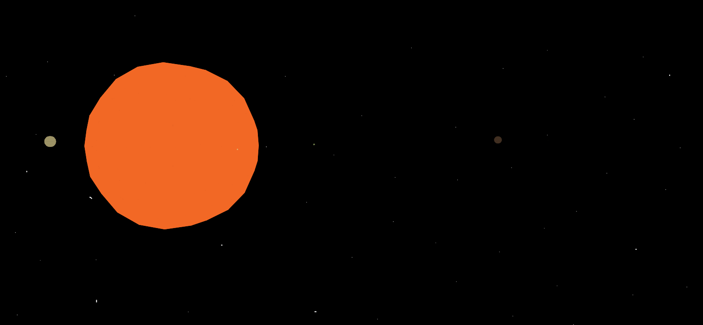
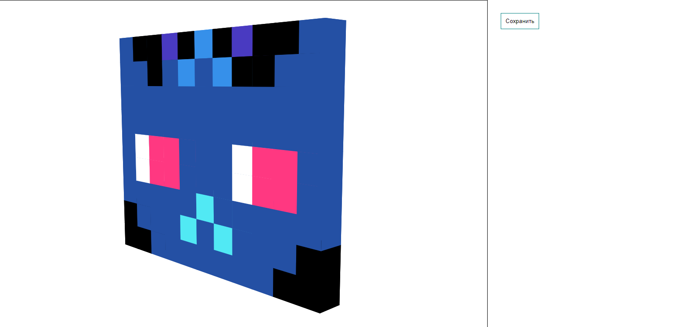

# 3D SVG engine

Lightweight 3D engine that uses SVG as a rendering environment.

Used technologies:

- [TypeScript](https://www.typescriptlang.org/) as the main language
- [Vite](https://vite.dev/) for the dev server and library build
- [Vitest](https://vitest.dev/) for unit tests
- [Oxlint](https://oxc.rs/docs/guide/usage/linter) and [Oxfmt](https://oxc.rs/docs/guide/usage/formatter) for linting and formatting
- [pnpm](https://pnpm.io/) as the package manager

# Getting started

You can link to the 3D SVG engine files hosted online:

```html
<script src="https://cdn.jsdelivr.net/npm/3d-svg-engine@0.1.0/dist/3dengine.dist.js"></script>
```

A sample HTML page might look like this:

```html
<!DOCTYPE html>
<html lang="en">
  <head>
    <meta charset="UTF-8" />
    <title>Starter template</title>
  </head>
  <body>
    <div id="world" style="width: 800px; height: 600px"></div>
    <script src="https://cdn.jsdelivr.net/npm/3d-svg-engine@0.1.0/dist/3dengine.dist.js"></script>
    <script>
      // create global object
      const engine = SVGEngine('world')
      // move the camera back a little
      engine.player.position = { x: 0, y: 0, z: -50 }
      // add cube on scene
      engine.add(engine.cube(10))
    </script>
  </body>
</html>
```

## How to control camera

Click on the root element to capture the pointer. While the pointer is captured you can rotate the camera with the mouse and use these keys:

|        Key | Effect        |
| ---------: | :------------ |
|     _WASD_ | Move camera   |
|    _shift_ | Flying down   |
| _spacebar_ | Flying up     |
|   _arrows_ | Rotate camera |

# Examples

- Simple model of the solar system: [Example](http://man_init.istu.webappz.ru/3d/dist/) 
- Voxel draw: [Example](http://man_init.istu.webappz.ru/3d/example2/) 

# Documentation

Coordinates: `x` points right, `y` points up, `z` points away from the camera. Angles are in degrees.

## Basic figures

Every figure accepts an optional `texture` — URL of an image stretched over each face.

### cube(size, x, y, z, color, texture)

|     Param | Description                     |  Default  |    Example    |
| --------: | :------------------------------ | :-------: | :-----------: |
|    _size_ | Cube side length                |     -     |    `10.23`    |
|       _x_ | x coordinate of the cube center |    `0`    |     `12`      |
|       _y_ | y coordinate of the cube center |    `0`    |     `23`      |
|       _z_ | z coordinate of the cube center |    `0`    |     `34`      |
|   _color_ | Cube color                      | `'black'` | `'#ff4433ee'` |
| _texture_ | Texture image URL               |     -     | `'brick.png'` |

### pyramid(size, x, y, z, color, texture)

|     Param | Description                        |  Default  |    Example    |
| --------: | :--------------------------------- | :-------: | :-----------: |
|    _size_ | Pyramid side length and height     |     -     |    `23.4`     |
|       _x_ | x coordinate of the pyramid center |    `0`    |    `23.3`     |
|       _y_ | y coordinate of the pyramid center |    `0`    |    `534.2`    |
|       _z_ | z coordinate of the pyramid center |    `0`    |    `-23.3`    |
|   _color_ | Pyramid color                      | `'black'` | `'#ffee99ee'` |
| _texture_ | Texture image URL                  |     -     | `'brick.png'` |

### parallelepiped(sizea, sizeb, sizec, x, y, z, color, texture)

|     Param | Description                               |  Default  |    Example    |
| --------: | :---------------------------------------- | :-------: | :-----------: |
|   _sizea_ | Depth (along z)                           |     -     |    `23.4`     |
|   _sizeb_ | Height (along y)                          |     -     |    `12.3`     |
|   _sizec_ | Width (along x)                           |     -     |    `10.3`     |
|       _x_ | x coordinate of the parallelepiped center |    `0`    |     `23`      |
|       _y_ | y coordinate of the parallelepiped center |    `0`    |     `2.2`     |
|       _z_ | z coordinate of the parallelepiped center |    `0`    |    `-3.2`     |
|   _color_ | Parallelepiped color                      | `'black'` | `'#ff443366'` |
| _texture_ | Texture image URL                         |     -     | `'brick.png'` |

### sphere(r, x, y, z, color, texture)

|     Param | Description                       |  Default  |    Example    |
| --------: | :-------------------------------- | :-------: | :-----------: |
|       _r_ | Sphere radius                     |     -     |    `34.4`     |
|       _x_ | x coordinate of the sphere center |    `0`    |     `23`      |
|       _y_ | y coordinate of the sphere center |    `0`    |    `23.4`     |
|       _z_ | z coordinate of the sphere center |    `0`    |    `34.5`     |
|   _color_ | Sphere color                      | `'black'` |  `'#993399'`  |
| _texture_ | Texture image URL                 |     -     | `'earth.png'` |

### floor(size, x, y, z, color, texture)

Horizontal square grid made of cells about 10 units wide.

|     Param | Description                      |  Default  |   Example    |
| --------: | :------------------------------- | :-------: | :----------: |
|    _size_ | Floor side length                |     -     |    `200`     |
|       _x_ | x coordinate of the floor center |    `0`    |     `0`      |
|       _y_ | y coordinate of the floor center |    `0`    |    `-10`     |
|       _z_ | z coordinate of the floor center |    `0`    |     `0`      |
|   _color_ | Floor color                      | `'black'` |   `'#888'`   |
| _texture_ | Texture image URL                |     -     | `'tile.png'` |

### square(size, x, y, z, color, texture)

Flat square in the XY plane.

### triangle(point1, point2, point3, color, texture)

Triangle by three points, e.g. `engine.triangle({ x: 0, y: 0, z: 0 }, { x: 10, y: 0, z: 0 }, { x: 0, y: 10, z: 0 }, 'red')`.

## Figure methods and properties

| Member                 | Description                                       |
| :--------------------- | :------------------------------------------------ |
| `translate(x, y, z)`   | Move the figure by the given offsets              |
| `setPosition(x, y, z)` | Move the figure center to the given point         |
| `rotate(ax, ay, az)`   | Rotate around the figure center by X, Y, Z angles |
| `setTexture(url)`      | Put a texture on every face                       |
| `position`             | Current center of the figure (read only)          |

## Player object

`engine.player` contains the camera position and view direction. You can set these properties too:

```js
engine.player.position = { x: 100, y: 150, z: 100 }
engine.player.rotation.ay = 90
```

|   Property | Description                                                                    |           Example            |
| ---------: | :----------------------------------------------------------------------------- | :--------------------------: |
| _position_ | Camera position                                                                | `{ x: 23, y: 46, z: -100 }`  |
| _rotation_ | Camera angles: `ay` — turn left/right, `az` — look up/down (±70°), `ax` — roll | `{ ax: 0, ay: 10, az: -10 }` |

## Engine functions

| Function                               | Description                                                     |
| :------------------------------------- | :-------------------------------------------------------------- |
| `add(...objects)`                      | Add figures to the scene                                        |
| `remove(...objects)`                   | Remove figures from the scene                                   |
| `update(callback)`                     | Call `callback` every frame (pass `null` to clear)              |
| `setBackground(urlImage)`              | Panorama background that scrolls when the camera turns          |
| `addBackgroundElement(urlImage, x, y)` | Extra background layer (clouds, mountains) with faster parallax |
| `start(fps = 120)` / `stop()`          | Resume / pause the render loop                                  |
| `destroy()`                            | Stop rendering, remove listeners and the SVG element            |
| `saveScreen()`                         | Download the current frame as an SVG file                       |

Example of an animation:

```js
const cube = engine.cube(10, 0, 0, 50, 'red')
engine.add(cube)
engine.update(() => cube.rotate(1, 1, 0))
```

# Development

Requires Node.js 22.12+ and pnpm (`corepack enable` picks up the version from `package.json`).

```sh
pnpm install
pnpm dev          # demo page (index.html) with hot reload
pnpm build        # build dist/3dengine.dist.js
pnpm test         # unit tests
pnpm lint         # oxlint
pnpm format       # oxfmt
pnpm check        # typecheck + lint + format check + tests
```
